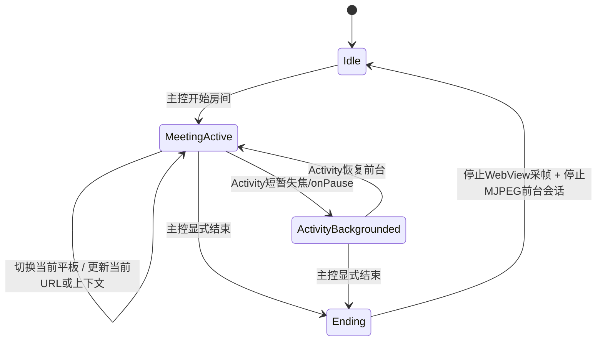

# fix: HarmonyOS 4.2 WebView meeting foreground hardening phase 1

## Overview

本计划修订后将 1 期承诺明确收窄为 `P1 前台专机运行方案`：仅在现有单 `Activity` + 单 `WebView` + MJPEG 链路上补齐前台运行约束、会话契约和失败闭环，使会议文件预览/会议录音页在鸿蒙 4.2 上以“前台专机”方式稳定运行。1 期不承诺后台保活、息屏保活、被系统杀死后的自动恢复，也不承诺原生重写会议栈；房间仅在主控显式结束时终止，切换平板仅切换当前显示/推流目标而不重建房间。

## Problem Frame

当前仓库已完成 WebView 内容经 `WebView.draw(Canvas)` 进入 MJPEG 输出链路，但实现仍是“页面宿主”和“推流服务”弱绑定：

- `app/src/main/java/info/dvkr/screenstream/SingleActivity.kt` 在 `onPause()` 中直接调用 `webView.onPause()`，会让网页媒体、JS 计时器和部分页面状态在任务切后台时进入暂停态。
- `mjpeg/src/main/java/info/dvkr/screenstream/mjpeg/internal/MjpegStreamingService.kt` 已支持 `StartWebViewStream` / `WebViewFrame`，但 WebView 流路径只是在服务内部置位 `webViewStreaming = true`，没有形成与“房间会话”一致的前台服务级保活语义。
- `mjpeg/src/main/AndroidManifest.xml` 当前只声明了 `mediaProjection` 型前台服务能力，和 WebView-only 推流路径不对齐。

这与会议场景的目标不一致：会议文件预览/会议录音页必须以前台专机语义运行，房间生命周期由主控显式结束控制，而不是由某次 `onPause`、切换平板或页面短暂失焦隐式结束。同时，现方案还缺少几个会导致实施偏航的关键信息：成功定义互相打架、房间/主控命令契约过于口头化、前台服务可行性验证位置过晚、失败回传没有闭环、`destroy/recreate` 语义未定、Web 安全上下文与 WebSocket/timer 行为缺少实机验证。

## Requirements Trace

- R1. 会议文件预览页/会议录音页作为房间宿主，在鸿蒙 4.2 上应以“前台专机运行”语义工作；1 期只保证应用保持前台且页面/推流链路不中断，不保证后台或息屏后继续运行。
- R2. 房间应持续到主控显式结束；切换当前查看的平板只改变当前推流目标，不重建房间、不重置 MJPEG 服务。
- R3. WebView 推流路径必须补齐前台服务级保护，与现有 MediaProjection 路径一样具备明确的前台通知/服务所有权；若前台服务类型或权限在鸿蒙 4.2 / targetSdk 36 下不可行，1 期必须显式失败并停止推进，不允许默认承诺成立。
- R4. 1 期必须复用现有单 `Activity` + 单 `WebView` + MJPEG 输出架构，不引入大规模 UI 或协议重构。
- R5. 计划需覆盖鸿蒙 4.2 重点风险、测试场景、验证口径、拟改造文件路径，以及失败回传到宿主/UI 的闭环。
- R6. 计划必须明确房间命令契约、`destroy/recreate` 语义、误结束会议与切换推流源的 UX 保护约束。

## Scope Boundaries

- 1 期只做本地宿主与 MJPEG 推流链路加固，不引入 WebRTC/RTSP 重新接管。
- 不在 1 期引入多窗口、多 Activity、独立渲染进程或完整房间后端。
- 不把网页音频采集改造成原生音频推流；`RECORD_AUDIO` 仍仅用于 WebView 页内 `getUserMedia(audio)`。
- 不承诺后台保活、息屏保活、Doze/省电白名单兜底、用户手动划杀进程或系统强杀后的自动恢复，这些都属于后续期能力。
- 不把更激进的“原生会话核 / 原生控制面 / 原生录音 / 原生观看页”作为 1 期交付承诺，但必须保留清晰后续路线图。

## Phase-1 Success Definition

1 期成功定义以“前台专机运行”作为唯一口径，避免与“后台保活”混淆：

- 成功：会议开始后，应用保持前台时，短暂失焦、弹窗、通知下拉、切换当前平板目标均不导致房间结束，不重建房间，不误停 MJPEG 推流。
- 成功：主控显式结束后，房间、页面采帧、前台通知、推流状态一致关闭，不残留假活跃状态。
- 成功：若前台服务拉起失败、通知权限不满足、服务类型不被接受，宿主能收到明确失败并阻止进入“看似开会中”的半成功状态。
- 不属于 1 期成功：应用退到后台后继续采集、息屏后继续录音/心跳、被系统杀死后自动恢复原房间。

## Context & Research

### Relevant Code and Patterns

- `app/src/main/java/info/dvkr/screenstream/SingleActivity.kt`
  - 当前 WebView 创建、加载、权限控制、帧循环提交、`onPause()/onResume()/onDestroy()` 都在这里。
- `mjpeg/src/main/java/info/dvkr/screenstream/mjpeg/MjpegStreamingModule.kt`
  - 已有 `startWebViewStreaming()` / `submitWebViewFrame()` / `stopWebViewStreaming()` 入口，可继续作为 app -> service 的桥。
- `mjpeg/src/main/java/info/dvkr/screenstream/mjpeg/internal/MjpegStreamingService.kt`
  - 已有事件驱动状态机、`webViewStreaming` 分支、`stopForeground()`、错误通知、客户端统计，是 1 期保活语义的主落点。
- `mjpeg/src/main/java/info/dvkr/screenstream/mjpeg/MjpegModuleService.kt`
  - 当前前台通知启动入口在这里，适合扩展为 WebView 会话的前台所有者。
- `common/src/main/java/info/dvkr/screenstream/common/CommonKoinModule.kt`
  - 当前公共单例注册点，若新增“会议会话协调器”或“前台策略协调器”，适合从这里挂入。

### Institutional Learnings

- `docs/webview-mjpeg-verification.md`
  - 已确认 WebView MJPEG 路径当前不走 MediaProjection，且帧循环由 `SingleActivity` 生命周期托管。
- `docs/solutions/best-practices/webview-mjpeg-without-mediaprojection-and-ci-hardening-2026-04-29.md`
  - 已确认当前方案的正确边界是“复用 MJPEG 输出，只替换帧源”，同时提醒 WebView 生命周期与性能是核心风险点。
- `docs/solutions/research/harmonyos-4.2-web-audio-websocket-must-requirements-2026-04-30.md`
  - 已明确 Web 安全上下文、WebSocket 心跳、JS timer 后台节流、网页录音权限都是鸿蒙 4.2 风险点，不能只做代码假设。

### External References

- 本计划不再额外扩展架构研究；实现前只允许补充与鸿蒙 4.2 前台服务类型、WebView 安全上下文、通知权限相关的必要核对。

## Key Technical Decisions

- 保留单 `Activity` + 单 `WebView` 架构，仅增加“会议会话状态”这一层抽象，而不是在 1 期拆分新宿主。
  - 理由：当前代码集中在 `SingleActivity`，1 期目标是前台加固，不是架构重写。
- 把“房间是否结束”从 `Activity` 短生命周期事件中解耦，改为受显式会话命令控制。
  - 理由：`onPause`、短暂失焦、切换查看平板都不应等价于结束会议。
- 将 `MjpegModuleService` 明确为 WebView 会议会话的前台服务所有者。
  - 理由：现有通知、错误恢复、服务生命期都在该模块，扩展成本最低，也最符合现有模块边界。
- WebView 会话采用“双保险”硬化：`Activity` 侧避免错误暂停，`Service` 侧维持前台通知与会话状态。
  - 理由：仅靠 `FLAG_KEEP_SCREEN_ON` 或仅靠服务前台都不足以满足鸿蒙 4.2 的会议场景。
- 1 期只支持“切换当前平板流目标”，不支持并行展示多个平板，也不重建房间。
  - 理由：与用户场景一致，且能显著降低状态同步复杂度。
- 把 FGS/type feasibility 提前为入场闸门，而不是实现尾部再验证。
  - 理由：如果 `MjpegModuleService` 在鸿蒙 4.2 / targetSdk 36 上无法以合法类型稳定进入前台，则整条 1 期路径不成立，必须尽早暴露。
- 1 期对 `destroy/recreate` 采用“会话显式终结优先、宿主重建可恢复但不自动续会”的保守语义。
  - 理由：避免把系统重建错误解释为房间还活着，也避免误自动续会。

## Room / Control Contract

1 期需要把“房间”“主控”“切换平板”从口头描述收敛成最小契约：

- `StartRoom(roomId, targetId, entryUrl)`：仅当宿主确认前台服务可进入准备态时才允许生效；成功后创建当前活动房间。
- `SwitchTarget(roomId, nextTargetId, nextUrlOrContext)`：仅允许作用于当前活动 `roomId`；效果是切换当前展示/推流目标，不结束房间、不重启服务。
- `EndRoom(roomId, reason=controller_explicit)`：这是 1 期唯一正常结束入口；收到后才允许进入关闭路径。
- `ForegroundStartFailed(roomId?, reason)`：前台服务或通知条件失败时由 service/module 向宿主回传，宿主必须结束“开会中”UI 并展示失败原因。
- `HostBackgrounded` / `HostForegrounded`：仅更新宿主可见性，不得改变房间是否结束。

契约约束：

- 非活动房间上的 `SwitchTarget` / `EndRoom` 必须被忽略或拒绝，避免串房。
- `SwitchTarget` 不得隐式触发 `StartRoom`。
- `EndRoom` 不得由 `onPause`、页面 reload、`Activity` recreate 自动触发。

## Open Questions

### Resolved During Planning

- 是否需要在 1 期改造成多 `Activity` 或独立前台页面？
  - 不需要。1 期保留 `SingleActivity`，只加状态与前台策略。
- 切换平板时是否应停流并重启房间？
  - 不应。只切换当前查看/采集目标，房间会话与 MJPEG 服务连续。

### Must Be Resolved Before Coding

- `MjpegModuleService` 面向 WebView-only 会话最终采用哪种前台服务类型声明，是否需要补充权限、通知渠道或 manifest 组合，必须先做可行性确认。
- 鸿蒙 4.2 实机上 `http://` 局域网页面是否满足当前录音页的安全上下文要求，`ws://` 与 `wss://` 控制链路、JS timer 在前台专机场景下是否稳定，必须先形成验证结论。

### Deferred to Implementation

- 若目标会议页存在额外 JS Bridge/URL 参数约定，具体切换平板协议可在实现时按实际 H5 契约补齐，但不得突破本计划列出的最小命令边界。

## High-Level Technical Design

> *This illustrates the intended approach and is directional guidance for review, not implementation specification. The implementing agent should treat it as context, not code to reproduce.*

## Lifecycle Semantics

- `onPause` / `onStop`：只表示宿主暂时失焦，不表示房间结束。
- `Activity recreate`：若是配置变化或系统重建，允许重建宿主并重新挂接当前会话状态，但不自动新建房间、不自动补发 `StartRoom`。
- `onDestroy`：只有在 `isFinishing` 或已收到 `EndRoom` 的关闭路径上，才允许把它视为最终资源释放点。
- 页面 reload：默认视为当前房间内的页面刷新，不等价于 `EndRoom`；若 reload 会丢失当前会议上下文，必须在 UX 或控制层显式限制。

## 拟改造模块与文件

- `app`
  - `app/src/main/java/info/dvkr/screenstream/SingleActivity.kt`
  - `app/src/main/AndroidManifest.xml`
- `common`
  - `common/src/main/java/info/dvkr/screenstream/common/CommonKoinModule.kt`
  - `common/src/main/java/info/dvkr/screenstream/common/session/MeetingSessionCoordinator.kt`（新增）
  - `common/src/main/java/info/dvkr/screenstream/common/session/MeetingSessionState.kt`（新增）
- `mjpeg`
  - `mjpeg/src/main/java/info/dvkr/screenstream/mjpeg/MjpegModuleService.kt`
  - `mjpeg/src/main/java/info/dvkr/screenstream/mjpeg/MjpegStreamingModule.kt`
  - `mjpeg/src/main/java/info/dvkr/screenstream/mjpeg/internal/MjpegEvent.kt`
  - `mjpeg/src/main/java/info/dvkr/screenstream/mjpeg/internal/MjpegStreamingService.kt`
  - `mjpeg/src/main/AndroidManifest.xml`
  - `mjpeg/src/main/res/values/strings.xml`

## Implementation Units

- [ ] **Unit 1: 引入会议会话协调层**

**Goal:** 给当前宿主补一层显式的房间会话状态，定义“开始房间 / 切换当前平板 / 显式结束房间”与 `Activity` 生命周期事件的边界。

**Requirements:** R1, R2, R4, R5, R6

**Dependencies:** None

**Files:**
- Create: `common/src/main/java/info/dvkr/screenstream/common/session/MeetingSessionCoordinator.kt`
- Create: `common/src/main/java/info/dvkr/screenstream/common/session/MeetingSessionState.kt`
- Modify: `common/src/main/java/info/dvkr/screenstream/common/CommonKoinModule.kt`
- Test: `common/src/test/java/info/dvkr/screenstream/common/session/MeetingSessionCoordinatorTest.kt`

**Approach:**
- 用单例协调器承载房间状态，至少覆盖 `Idle`、`Active(roomId,currentTarget,hostVisibility)`、`Ending`、`StartRejected(reason)` 四类状态。
- 明确区分“主控显式结束”与“页面短暂失焦”；后者只能标记宿主前后台状态，不能触发房间关闭。
- 把 `StartRoom` / `SwitchTarget` / `EndRoom` / `ForegroundStartFailed` 定义成明确事件，而不是散落的布尔开关。
- 为 `SingleActivity` 与 MJPEG 模块提供统一的读写入口，避免两边各自维护一套布尔值。

**Patterns to follow:**
- `common/src/main/java/info/dvkr/screenstream/common/module/StreamingModuleManager.kt`
- `common/src/main/java/info/dvkr/screenstream/common/settings/AppSettings.kt`

**Test scenarios:**
- Happy path: 开始房间后状态进入 `Active`，并记录当前平板/页面目标。
- Happy path: 在 `Active` 状态切换平板，仅更新当前目标，不进入 `Idle`。
- Edge case: `Activity` 标记为后台后，会话仍保持 `Active`，不会触发结束。
- Error path: `Idle` 状态收到“切换平板”命令时应拒绝或无效化，避免产生悬空目标。
- Error path: service 回传 `ForegroundStartFailed` 后，会话必须退出待启动态，防止宿主误显示“会议中”。

**Verification:**
- 房间结束条件从 `SingleActivity.onPause()` 等短生命周期事件中剥离，改由协调层显式控制。

- [ ] **Unit 2: WebView 宿主生命周期硬化**

**Goal:** 让 `SingleActivity` 在会议场景下不再把 `onPause` 直接等价为网页暂停/房间结束，并把切换平板行为收敛到同一 WebView 会话内，同时加入避免误结束会议与误切源的 UX 约束。

**Requirements:** R1, R2, R4, R6

**Dependencies:** Unit 1

**Files:**
- Modify: `app/src/main/java/info/dvkr/screenstream/SingleActivity.kt`
- Modify: `app/src/main/AndroidManifest.xml`
- Test: `app/src/androidTest/java/info/dvkr/screenstream/SingleActivityMeetingSessionTest.kt`

**Approach:**
- 将 `webView.onPause()` 从无条件 `onPause()` 调用改为受会议会话状态约束；只有显式结束房间或真正销毁宿主时才进入最终暂停/销毁。
- 把“切换当前平板”落成同一 `WebView` 中的 URL/上下文更新，而不是重建 `Activity` 或停止 MJPEG 模块。
- 在 Manifest/Activity 属性层面补充会议宿主的前台保持语义所需约束，但不改变单 Activity 入口形态。
- 对“结束会议”操作加入显式确认或双态校验，对“切换平板”操作加入当前房间上下文校验，避免把切源误解释为结束房间。

**Patterns to follow:**
- `app/src/main/java/info/dvkr/screenstream/SingleActivity.kt`

**Test scenarios:**
- Happy path: 活跃会议中触发 `onPause()` 后，页面恢复前台时 WebView 仍保持会话上下文，MJPEG 推流不中断。
- Happy path: 活跃会议中切换平板时，不触发 `stopWebViewStreaming()`，仅更新当前显示目标。
- Edge case: 配置变化或短暂系统弹窗导致的失焦，不应结束房间。
- Error path: 显式结束房间后再回到前台，不应自动恢复旧房间。
- Error path: 用户误触返回/关闭入口时，不应直接结束房间；至少要经过显式确认或受控的主控结束动作。
- Integration: `SingleActivity` 销毁时，只有在会话已结束或明确关闭路径上才停止 WebView 采帧并释放资源。

**Verification:**
- `SingleActivity` 生命周期变为“配合会话状态工作”，而不是“直接决定房间生死”。

- [ ] **Unit 3: 为 WebView 路径补齐前台服务级保护**

**Goal:** 让 WebView-only 推流路径拥有与 MediaProjection 路径等价的前台服务所有权、通知和停止语义，并把前台启动失败完整回传到宿主。

**Requirements:** R1, R3, R4, R5, R6

**Dependencies:** Unit 1

**Files:**
- Modify: `mjpeg/src/main/java/info/dvkr/screenstream/mjpeg/MjpegModuleService.kt`
- Modify: `mjpeg/src/main/java/info/dvkr/screenstream/mjpeg/MjpegStreamingModule.kt`
- Modify: `mjpeg/src/main/java/info/dvkr/screenstream/mjpeg/internal/MjpegEvent.kt`
- Modify: `mjpeg/src/main/java/info/dvkr/screenstream/mjpeg/internal/MjpegStreamingService.kt`
- Modify: `mjpeg/src/main/AndroidManifest.xml`
- Modify: `mjpeg/src/main/res/values/strings.xml`
- Test: `mjpeg/src/test/java/info/dvkr/screenstream/mjpeg/internal/WebViewForegroundSessionTest.kt`

**Approach:**
- 先完成 FGS/type feasibility 验证，再进入正式改造；若 feasibility 不成立，则 1 期应收敛为“不可交付并给出阻塞报告”，而不是继续编码假设。
- 把 `StartWebViewStream` 从“仅切换 service 内部状态”升级为“启动或维持前台服务中的 WebView 会议会话”。
- 为 WebView 会话建立独立的前台开始/结束分支，使 `service.stopForeground()` 只在房间显式结束或不可恢复错误时发生。
- 前台通知文案与停止动作应反映“会议房间仍在进行”，而不是传统的“开始/停止投屏”语义。
- Manifest 中的前台服务声明要对齐 WebView-only 场景，避免继续把 WebView 路径硬绑在 `mediaProjection` 前提上。
- 失败路径必须从 service/module 闭环回到协调层和宿主 UI，包括通知权限缺失、前台启动异常、前台类型不接受、服务被撤销等。

**Patterns to follow:**
- `mjpeg/src/main/java/info/dvkr/screenstream/mjpeg/MjpegModuleService.kt`
- `mjpeg/src/main/java/info/dvkr/screenstream/mjpeg/internal/MjpegStreamingService.kt`
- `common/src/main/java/info/dvkr/screenstream/common/module/StreamingModuleService.kt`

**Test scenarios:**
- Happy path: 开始 WebView 会议会话时，服务进入前台且 `isStreaming=true`。
- Happy path: 房间活跃期间切换平板目标，不触发前台服务重启或通知消失。
- Edge case: `Activity` 短暂后台但服务仍在前台时，`WebViewFrame` 恢复后可继续输出到 `bitmapStateFlow`。
- Error path: 通知权限缺失或前台启动失败时，应有明确错误状态，不允许静默进入“房间看似进行但服务已失保活”的半失效态。
- Error path: 前台启动已失败时，宿主不得继续允许切源或显示“会议进行中”。
- Integration: 显式结束房间后，前台通知移除、`webViewStreaming=false`、后续旧帧不再写入输出流。

**Verification:**
- WebView 路径具备明确的前台服务所有权，不再只是 service 内部的轻量分支。

- [ ] **Unit 4: 验证与文档补强**

**Goal:** 把 1 期风险、验证口径和鸿蒙 4.2 场景验收落成可复用测试/文档资产。

**Requirements:** R5

**Dependencies:** Unit 2, Unit 3

**Files:**
- Create: `docs/harmony42-meeting-foreground-phase1-verification.md`
- Test: `app/src/androidTest/java/info/dvkr/screenstream/SingleActivityMeetingSessionTest.kt`
- Test: `mjpeg/src/test/java/info/dvkr/screenstream/mjpeg/internal/WebViewForegroundSessionTest.kt`
- Test: `common/src/test/java/info/dvkr/screenstream/common/session/MeetingSessionCoordinatorTest.kt`

**Approach:**
- 按仓库约定把并发/场景验证结果落到 `docs/*.md`，记录测试命令、设备条件和结果摘要。
- 验证重点围绕“房间不因 `onPause` 结束”“切平板不重建房间”“前台服务在 WebView 会话中有效”“显式结束才真正停流”。
- 必须单列鸿蒙 4.2 实机验证：secure context、`getUserMedia(audio)`、`ws://`/`wss://` 控制链路、JS timer/心跳在前台专机场景下是否被节流。
- 若 HarmonyOS 4.2 实机与 AOSP 模拟行为不一致，文档中明确记录差异与补救策略。

**Patterns to follow:**
- `docs/webview-mjpeg-verification.md`

**Test scenarios:**
- Happy path: 实机上开始会议后连续切换多个平板目标，房间 ID/推流地址保持不变。
- Edge case: 来电弹窗、权限弹窗、系统通知下拉后恢复前台，房间仍存在且可继续推流。
- Error path: 前台通知权限关闭时，开始会议应失败并给出可见提示。
- Error path: `http://` 页面不满足录音安全上下文、WS 心跳异常或 timer 被明显节流时，文档必须明确标红为 1 期阻塞或已知限制。
- Integration: 主控显式结束后，页面、服务、通知和帧循环都进入关闭态，不残留后台推流。

**Verification:**
- 形成一份可重复执行的 1 期验收文档，覆盖命令、场景和结论。

## System-Wide Impact

- **Interaction graph:** `SingleActivity`、`MeetingSessionCoordinator`、`MjpegStreamingModule`、`MjpegStreamingService`、`MjpegModuleService` 将形成明确的会话所有权链路。
- **Error propagation:** 前台服务启动失败、通知权限不足、会话结束命令都应能从 service 层回传到宿主状态，而不是只写日志。
- **State lifecycle risks:** 需要避免 `Activity` 与 service 双方各自持有“是否正在会议中”的布尔状态，防止一边结束一边继续推流。
- **API surface parity:** WebView 路径要补齐与 MediaProjection 路径相同级别的“开始前台/停止前台/错误通知”语义，但不复用其权限模型。
- **Integration coverage:** 仅单元测试不足以证明鸿蒙 4.2 的前后台切换行为，必须有设备场景验收。
- **Web runtime dependency:** 1 期真实可用性仍受网页安全上下文、网页录音权限、WS 心跳和 JS timer 行为影响，必须把这些作为同等级验收项。
- **Unchanged invariants:** MJPEG 仍是唯一流模式；网页音频权限同源校验保持不变；不引入 RTSP/WebRTC 返场。

## Risks & Dependencies

| Risk | Mitigation |
|------|------------|
| HarmonyOS 4.2 对后台清理比 AOSP 更激进，单纯避免 `webView.onPause()` 仍可能不够 | 采用 `Activity` 生命周期硬化 + `MjpegModuleService` 前台保活双保险，并要求实机验证 |
| WebView 保持活跃会增加 CPU/内存占用 | 1 期不提高帧率，继续复用现有帧循环节奏，并把性能观察纳入验收 |
| 前台服务类型/通知策略若与 WebView 路径不匹配，可能出现启动失败或系统告警 | 在编码前完成 feasibility 验证；失败时输出阻塞结论并停止 1 期承诺，不得静默降级 |
| 切换平板如果通过整页 reload 实现，可能导致房间感知被误判为重建 | 会话状态与页面目标解耦，验证时明确检查房间连续性 |
| 网页录音安全上下文、WS 心跳或 JS timer 在鸿蒙 4.2 前台专机场景下不稳定 | 纳入必测清单；若不满足则记录为已知限制或后续期改造前置条件 |

## Documentation / Operational Notes

- 1 期完成后应新增鸿蒙 4.2 前台会议场景验收报告，放在 `docs/` 根目录。
- 若实现期发现 HarmonyOS 4.2 需要额外的“受保护应用/任务锁定”用户指引，应同步更新现有引导文案，但不改变本计划的技术边界。

## Later Phases Roadmap

后续路线保留，但不纳入 1 期交付承诺：

### Phase 2: 原生会话核

- 目标：把“房间是否存在、当前目标是谁、何时结束”从 `WebView` 页面状态里进一步抽离，形成 app 内可持久化、可恢复、可审计的原生会话核。
- 边界：仍可继续复用 WebView 作为观看/互动承载，但房间真值不再依赖页面 JS 状态。
- 触发条件：1 期已证明前台专机路径成立，但 `Activity`/WebView 重建语义仍过脆。

### Phase 3: 原生 WS 控制面

- 目标：把主控开始/切源/结束等控制命令从网页 JS 心跳中抽离为原生 WebSocket 或等价原生控制通道。
- 边界：只先原生化控制面，不强制同时原生化观看页。
- 收益：降低 WebView timer 节流、页面 reload、H5 状态漂移对房间控制面的影响。

### Phase 4: 原生录音

- 目标：把会议录音从 WebView `getUserMedia(audio)` 迁到原生采集链路，摆脱 secure context、网页权限回调和 H5 生命周期限制。
- 边界：是否与 MJPEG 绑定传输、是否独立音频通道，需要在该阶段单独决策；1 期不预判实现形态。
- 触发条件：若鸿蒙 4.2 下网页录音稳定性或权限闭环无法满足业务要求，应优先推进该阶段。

### Phase 5: 观看页 / UI 原生化评估

- 方向 A：继续保留 WebView 观看页，仅把控制面与录音原生化，最小化重写成本。
- 方向 B：将关键会议观看 UI、切源交互、状态提示逐步原生化，WebView 仅承载必要网页内容或被完全替换。
- 决策边界：只有在 1 期和后续阶段证明 WebView 生命周期、性能或可维护性已成为核心瓶颈时，才承诺完整 UI 原生化；当前只保留路线，不预先锁死。

## Sources & References

- Related doc: `docs/webview-mjpeg-verification.md`
- Related doc: `docs/solutions/best-practices/webview-mjpeg-without-mediaprojection-and-ci-hardening-2026-04-29.md`
- Related doc: `docs/solutions/research/harmonyos-4.2-web-audio-websocket-must-requirements-2026-04-30.md`
- Related code: `app/src/main/java/info/dvkr/screenstream/SingleActivity.kt`
- Related code: `mjpeg/src/main/java/info/dvkr/screenstream/mjpeg/MjpegModuleService.kt`
- Related code: `mjpeg/src/main/java/info/dvkr/screenstream/mjpeg/internal/MjpegStreamingService.kt`
